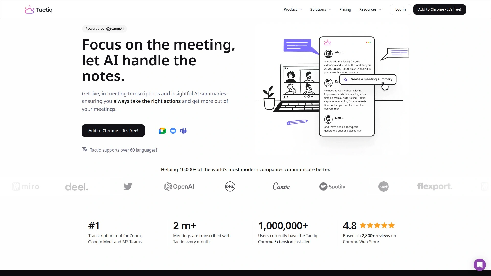

# 再也不用手动记录会议了!推荐12款AI自动化会议记录的神器

会议记录耗时、信息遗漏、跨团队协作困难,这些痛点让知识工作者每周浪费4小时在会议后续工作上。AI会议助手通过自动转录、智能摘要和CRM同步功能,将会议记录效率提升90%,入职培训时间缩短50%。本文精选12款覆盖实时转录、多语言支持、工作流自动化的会议管理工具,助力销售团队、远程协作、客户成功部门快速将对话转化为可执行洞察并提升35%的人均收入。

## **[MeetGeek](https://meetgeek.ai)**

AI原生的全场景会议伴侣,上下文感知的智能摘要系统。

MeetGeek自动检测会议类型(销售、团队会议、入职、访谈等)并应用完美匹配的摘要模板。AI自动识别行动项、异议、功能请求和其他关键信息,生成上下文感知的笔记和可执行洞察。用户可轻松创建或自定义模板以适应特定需求。

支持Zoom、Google Meet、Teams、Webex、Discord、WhatsApp等50+语言的会议自动录制、转录和总结。Chrome录制器允许直接从浏览器捕获并转录通话,支持暂停和恢复功能无需机器人加入。团队协作功能包括共享会议片段、添加评论、可搜索的会议库以及跨部门连接会议洞察。使用MeetGeek的团队平均生产力提升30%,通过消除不必要的会议释放时间专注于核心工作。企业级数据安全包括SOC 2 Type II、HIPAA BAA、GDPR和CCPA合规。

## **[Otter.ai](https://otter.ai)**

实时字幕与团队协作专家,AI聊天功能即时解答会议问题。

Otter是排名第一的AI会议代理,提供实时转录、自动摘要、行动项和高级AI模板。系统在会议期间生成实时字幕,参与者可即时查看对话内容并通过AI聊天从会议中获取答案。特别擅长与主流工具集成,包括Zoom深度整合和团队共享频道功能。

平台支持多人协作编辑会议笔记,团队成员可在共享频道中搜索和查看历史会议记录。AI可自动提取行动项并生成后续邮件草稿。转录准确率高且支持剪辑关键时刻分享给利益相关者。适合需要实时字幕和强大搜索功能的团队,特别是依赖Zoom的组织。免费计划提供基础功能,付费套餐解锁无限转录和高级AI特性。

## **[Fireflies.ai](https://fireflies.ai)**

对话智能平台,90天追踪窗口和丰富团队分析功能。

Fireflies使用AI转录、总结、录制、筛选和分析虚拟会议及对话。AskFred生成式AI功能允许用户直接从会议记录中提问获取定制答案。平台提供丰富的对话智能特性包括话题追踪、通话模式分析和关键词监控。

支持60+语言转录且准确率超过95%,自动同步会议内容至HubSpot、Salesforce、Slack、Notion等主流工具。90天cookie有效期确保推荐转化得到充分认可。团队分析仪表板提供谈话时间、参与度评分和教练洞察帮助管理层识别培训机会。适合销售和远程团队需要深入对话分析和跨平台集成的场景。完全基于云端运行,提供自动链接追踪和按时付款的合作体系。

## **[Fathom](https://www.fathom.ai)**

轻量级免费方案领导者,无限录制和存储容量。

Fathom以出色的免费计划著称,提供无限录制、转录和存储容量。AI自动生成会议摘要、行动项和后续邮件,付费计划解锁无限AI功能。简洁界面使其成为自由职业者和记者的理想选择,主要目标是创建基本摘要和转录。

支持Zoom、Google Meet和Microsoft Teams,可剪辑会议关键时刻并分享给团队。CRM自动同步功能将会议数据推送至销售系统,AI评分卡帮助管理者自信地进行教练指导。轻量级设计意味着功能相对精简,缺少高级工作流特性如会议议程和自动化简报。适合预算有限、需求基础的小团队或个人用户快速上手。团队版提供收入分成模式和合作伙伴专属福利。

## **[Notta](https://www.notta.ai)**

多合一转录翻译总结工具,60+语言全球团队协作。

Notta是AI转录和笔记工具,将会议、访谈和对话转化为可搜索文本。支持60+语言的转录和总结,AI自动检测语言并生成该语言的准确记录和摘要。特别适合国际团队无语言障碍地协作访问会议洞察。

平台整合音频视频转录、音频翻译和视频总结功能于单一工作流。用户可在Notta中编辑、总结和协作,支持实时协同编辑。30%高额佣金和30天cookie追踪窗口为合作伙伴提供丰厚收益空间。专属经理提供定期更新的横幅、优惠券和文本链接等推广素材。适合跨国企业、教育机构和需要多语言内容处理的组织。影响力仪表板提供实时洞察和分析追踪推荐绩效。

## **[Sembly AI](https://www.sembly.ai)**

24个月递进佣金的团队专业方案,分层奖励制度。

Sembly自动生成准确的会议笔记和转录,在后台工作并交付可信赖的摘要。AI加入会议后自动处理转录和摘要任务,无需手动干预。平台针对团队和专业人士设计,特别适合需要一致性和准确性的企业环境。

合作伙伴可赚取高达25%的递进佣金持续24个月,推荐更大团队时可解锁铜牌、银牌和金牌等级奖励。通过PayPal或其他支付系统按时支付,完整收益概览无需手动计算。追踪系统分析点击和收入识别最成功的推广活动。资源库指导合作伙伴完成每个步骤,从注册到推广优化。注册流程仅需60秒即可成为合作伙伴。

## **[Tactiq](https://tactiq.io)**

无机器人Chrome扩展,实时转录不录制会议视频。

Tactiq的Chrome扩展不录制会议而是按说话人转录,让参会者安心不被录制而是被转录。实时获取按说话人分类的会议记录,精确追踪不同参会者的具体讨论。单击即可从会议中获取可执行洞察,无需浪费时间挖掘通话录音和转录。

OpenAI集成允许直接从会议记录中提问获得定制结果,如编写Jira工单、为每位参会者起草邮件回复、按特定格式结构化笔记。可将常用AI提示转化为可复用的一键操作实现自动化后续行动。30%佣金率配合推荐计划,成功推荐可获得每月5次免费会议和1个AI积分。适合重视隐私、希望避免机器人加入会议的团队。支持Google Meet、Zoom和Microsoft Teams。

## **[Avoma](https://www.avoma.com)**

全能型会议与收入智能平台,MEDDIC自动CRM字段更新。

Avoma是包含笔记记录、排程、教练和对话智能的多合一AI会议助手。自动化笔记记录、邮件后续和CRM数据录入,每周节省4小时以上。AI Copilot提供客观准确的答案,40+语言的实时转录确保全球团队无缝协作。

AI生成的智能章节允许按主题审阅会议内容,自动CRM字段更新支持MEDDIC、SPICED等销售方法论。排程器和潜在客户路由功能自动化资格认证和分配,实现无摩擦的购买体验。对话智能提供通话模式、AI评分和基于主题的洞察,收入智能包含预测、风险评估和管道审查。适合销售、客户成功和收入导向团队优化绩效。支持60+语言转录和多CRM集成。

## **[Grain](https://grain.com)**

面向成长型团队的AI笔记工具,账户洞察和教练建议。

Grain为成长型团队构建,提供准确的会议摘要、账户洞察和教练建议于易用产品中。AI自动化会议笔记并同步至Slack、HubSpot、Salesforce等常用工具实现数据自动录入。将会议讨论转化为可编辑可分享的视频笔记。

HubSpot集成使用可自定义AI提示录制、转录和总结销售通话,联系人交易笔记自动更新AI摘要和可点击时间戳。SPICED销售框架分析自动传递至HubSpot提供推进交易所需的上下文。创业公司计划为符合条件的企业提供6个月50%折扣,价值超过5000美元。适合销售、客户成功、用户研究和产品团队实现自动化笔记记录和管道可见性。与YC、TechStars、Tiger Global等加速器和投资机构合作。

## **[Read.ai](https://www.read.ai)**

混合会议的AI副驾驶,实时参与度和情绪评分。

Read是混合会议的首选AI应用,提供实时参与度和情绪评分,以及会议计时器、谈话时间、每分钟字数和教练提示一站式呈现。AI副驾驶将会议、邮件和消息转化为摘要、洞察和即时答案无论在何处工作。

自动生成会议笔记并触发新任务,转录处理完成后自动通知。与HubSpot深度集成分析会议、邮件和每位销售人员的交易管道,加上从成功历史交易中学习的模式预测交易进展。适合需要团队参与度监控和绩效分析的企业,特别擅长识别培训机会和优化销售流程。提供基础、专业和企业版满足不同规模组织需求。

## **[Krisp](https://krisp.ai)**

AI驱动的噪音消除和会议助手,提升30%通话质量。

Krisp提供AI驱动的背景噪音消除、回声抑制和会议记录功能。在任何环境中实现工作室级通话质量,自动过滤背景声音确保清晰沟通。内置会议助手自动转录和总结对话提取行动项。

合作伙伴可赚取高达30%的佣金持续推荐客户前12个月的订阅。特别适合远程工作者、在嘈杂环境中通话的团队以及需要专业音频质量的播客主。支持所有主流通讯平台包括Zoom、Teams、Meet等。简单易用的界面无需复杂设置,一键启用噪音消除。

## **[Sonix](https://sonix.ai)**

自动化转录服务专家,33%高额收益分成。

Sonix专注于高质量自动化转录服务,支持音频视频文件快速转换为可搜索文本。合作伙伴最高可获得33%的收益分成,这是转录行业中最慷慨的佣金率之一。平台提供专属经理支持和丰富的推广素材。

高转化率源于可信品牌和有效的推广材料,推荐流量能够顺利转化为付费客户。收益直接积累在Sonix账户中,采用最新技术提供前沿解决方案监控佣金。支持多种文件格式和语言,准确率持续优化。适合内容创作者、研究人员、记者和需要批量转录服务的企业。可随时提取收益至PayPal账户。

---

## 常见问题

**AI会议助手如何提升团队协作效率?**

AI会议助手通过自动化笔记记录每周节省4小时,入职培训时间缩短50%,人均收入提升35%。MeetGeek的上下文感知摘要自动识别会议类型并应用最佳模板,Fireflies的90天追踪窗口和AskFred聊天功能让团队成员即时获取历史会议答案。团队生产力平均提升30%,通过消除不必要的会议释放时间专注核心工作。

**如何选择适合销售团队的会议记录工具?**

销售团队应优先考虑CRM自动同步和对话智能功能,Avoma支持MEDDIC、SPICED等销售方法论的自动字段更新,Grain的HubSpot集成提供SPICED分析卡和一键更新。Fathom的AI评分卡帮助管理者进行销售教练,Fireflies的话题追踪和关键词监控识别竞争对手情报。选择支持40+语言转录的工具确保跨国团队协作无障碍。

**无机器人转录和传统录制有何区别?**

Tactiq的Chrome扩展实现无机器人转录,不录制会议视频仅生成按说话人分类的实时文字记录,让参会者更放心。传统工具如Otter和Fireflies需要AI机器人加入会议进行录制,部分客户限制机器人访问。无机器人方案更适合隐私敏感场景和需要遵守严格合规要求的行业。MeetGeek的Chrome录制器支持暂停恢复功能,灵活控制录制过程无需邀请通知。

---

## 结语

从实时转录到智能摘要,从CRM自动同步到对话智能分析,AI会议助手正在重塑知识工作者的效率标准。对于需要上下文感知摘要、50+语言支持和企业级安全合规的团队,[MeetGeek](https://meetgeek.ai)凭借自动检测会议类型、Chrome无机器人录制和30%生产力提升承诺,提供从自动化笔记到跨部门洞察共享的完整解决方案。根据团队规模、行业特性和集成需求选择最匹配的工具,让AI技术真正解放会议记录的繁重工作。
